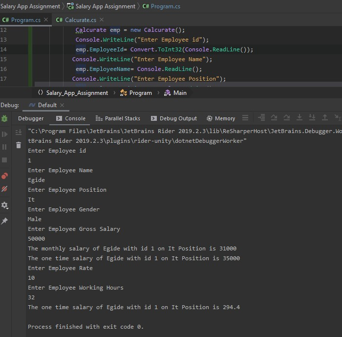

# Salary-App-Assignment  
This is An App that helps to calculate the Salary of  Employees of a company where the user enters employee information and
the app calculates the one-time salary,hourly salary,mouthly salary
Done By:
Name : SIBOMANA Iragena Egide 
Reg:218006691

